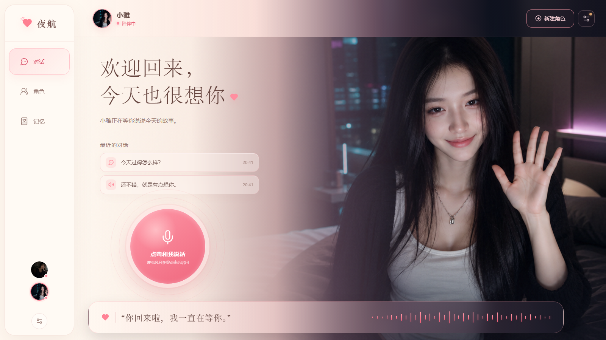
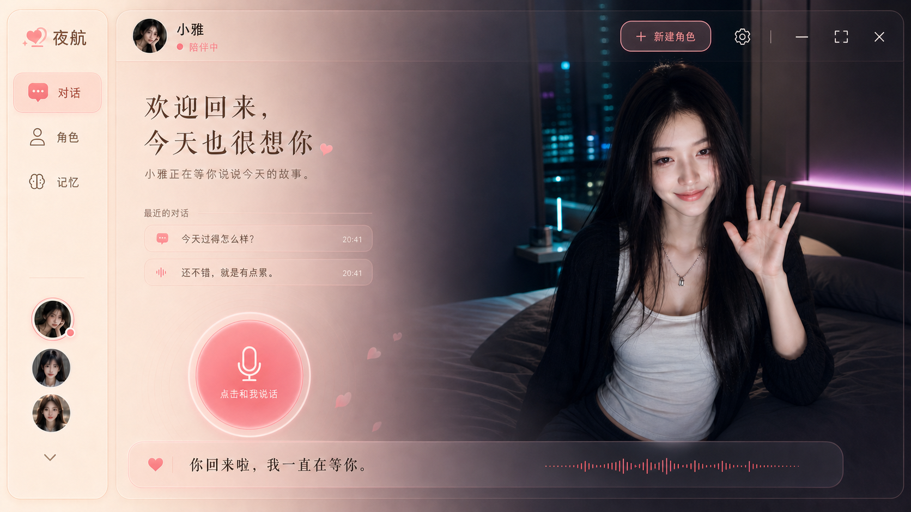
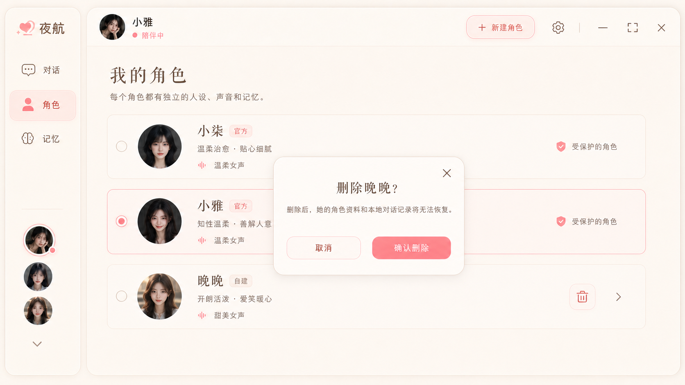

# 低配版赛博女友（16GB 显存）

**让一张角色图片拥有声音、表情和与你对话的能力。**

上传角色图片、设定性格，按下麦克风说话。角色听懂后会给出贴合设定的回答，播放合成语音，并在本地生成带口型和表情的回应视频。

**一次回应的旅程：** 麦克风 → 火山引擎语音识别 → DeepSeek 生成回复 → 火山引擎语音合成 → LivePortrait / MuseTalk 本地动画 → 浏览器播放。

[看界面](#界面展示) · [看功能](#功能一览) · [准备环境](#运行前需要准备) · [启动项目](#前端与接口服务的启动入口) · [配置说明](docs/CONFIGURATION.md) · [隐私说明](docs/PRIVACY.md)

> **定位说明：**“16GB 显存”是本项目面向的配置方向，指 GPU 显存，不是系统内存。当前尚未提供公开版在全新环境中的显存峰值、耗时或帧率基准，不代表所有 16GB 显卡都能达到相同效果。

## 界面展示

### 语音对话与数字人回应 · 当前界面



这是当前应用在全新浏览器数据环境中的待机画面。画面使用已获准公开的角色形象；“最近的对话”是界面内置示例文案。完成服务和动画环境配置后，生成的回复视频会在角色区域播放。

### 视觉概念：陪伴首页与角色管理

下面两张是设计阶段的概念图，用于展示项目的视觉方向；文字、布局和角色数量可能与当前运行界面不同。





README 中的展示图只用于介绍体验。公开源码的默认角色仍使用通用占位图，安装后可自行创建角色并上传图片。

## 从哪一步开始

| 想体验的部分 | 需要准备 | 可以看到什么 |
| --- | --- | --- |
| 浏览界面 | Windows、Node.js、pnpm | 本地打开角色与对话界面 |
| 语音对话 | 再配置自己的 DeepSeek 与火山引擎服务 | 识别语音、生成回复并播放合成语音 |
| 角色视频 | 再准备 NVIDIA / CUDA、Python、LivePortrait / MuseTalk 及模型权重 | 使用自己上传的角色图片生成带口型和表情的视频 |

建议先[启动页面](#前端与接口服务的启动入口)，在设置中完成对话测试和语音试听，再配置本地动画。下载源码后仍需自行安装依赖、模型并填写自己的服务凭据。

## 你可以用它做什么

### 和角色开口聊天

点击麦克风说话，程序将录音转换为语音服务可接收的格式，并识别你说的内容。界面会显示识别文字和角色回复，再播放合成语音。录音支持静音检测，也会在达到时长上限时结束。

对话请求会带上角色名称、性格、已有记忆条目和近期聊天上下文，让回应围绕当前角色展开。

### 用自己的图片创建角色

在角色管理界面添加角色，上传形象图片并填写名称、性格等信息。不同角色拥有各自的聊天记录，可以切换，也可以删除自己创建的角色。

公开源码的默认角色使用通用占位图；README 中的展示图不会作为可选角色或模型素材安装到应用。个人角色原图、私密设定、测试视频和既有对话不在仓库中。请新建角色并上传自己的图片后体验口型动画。

### 看见带口型和表情的回复

程序将角色形象、回复语音和表情参数交给本地动画服务，结合 LivePortrait 的人像动作与 MuseTalk 的口型处理生成视频，再回到页面播放。

回复行为支持开心、害羞、难过、关心、生气、惊讶与中性等状态，并包含强度参数。动画服务使用这些参数选择和调整动作；代码中还包含嘴部细节处理、收口过渡和结尾停顿等后处理。

当前流程是**一轮语音输入 → 生成回复 → 生成视频 → 播放**。首次加载模型、准备角色和生成视频需要等待，尚不是边说边生成的连续实时视频通话。动画生成失败时，前端会尝试回退到纯语音播放。

### 为每个角色保留独立的聊天上下文

角色资料与聊天记录保存在当前浏览器的本地存储中，刷新后会尝试恢复；前端按角色保留最近 40 条消息，后端会截取近期上下文参与回复。

记忆面板可以展示角色数据中已有的记忆条目，并将这些条目用于对话提示。公开示例不包含原作者的记忆内容。目前没有自动总结聊天、自动写入长期记忆或跨设备同步功能。

### 在界面中配置和测试服务

设置面板提供 DeepSeek 与火山引擎相关配置入口，可以保存服务配置、查看配置状态、测试对话服务，并试听语音合成结果。语音合成音色通过服务配置设置；目前不是每个角色独立绑定一套合成音色。

后端保存配置时调用密钥保护函数，读取配置的接口只返回配置状态与必要的非密钥参数，不返回真实 API Key 或 Token。公开上传时也会排除本地配置文件，包括其中的加密凭据。

## 功能一览

| 功能 | 当前代码中的实现 |
| --- | --- |
| 麦克风对话 | 浏览器录音、静音检测、语音识别、回复文字展示 |
| 角色化回复 | 结合角色设定、已有记忆和近期对话调用 DeepSeek |
| 语音播放 | 火山引擎 TTS 合成回复并在页面播放 |
| 自定义角色 | 上传形象图片，添加、切换和删除自建角色 |
| 口型与表情 | 本地动画生成、情绪与强度参数、视频播放 |
| 容错体验 | 动画请求失败时尝试回退到语音 |
| 本地会话保存 | 按角色保存浏览器中的近期聊天记录 |
| 配置界面 | 服务配置状态、对话测试、语音试听 |

## 它是怎样工作的

1. 浏览器录制麦克风声音，把录音交给本地 Node.js 后端。
2. 后端调用火山引擎进行语音识别，得到本轮输入文字。
3. DeepSeek 根据角色设定与近期上下文生成回复。
4. 后端解析回复的表情参数，调用火山引擎合成语音。
5. 本地 Python 动画服务使用角色图片、回复音频和表情参数生成视频。
6. 浏览器播放结果，并保存本轮聊天记录。

**本地运行与云端调用同时存在。** 网页、后端和动画服务运行在本机；语音识别、对话生成和语音合成会使用外部 API。录音会交给语音识别服务，角色设定、记忆与近期对话会进入对话请求，回复文字会交给语音合成服务。当前版本需要联网并使用自己的服务凭据。

## 技术组成

| 部分 | 技术与职责 |
| --- | --- |
| 前端 | React、TypeScript、Vite；负责角色界面、录音、状态展示和媒体播放 |
| 接口服务 | Node.js；负责配置、角色图片、对话、语音和动画请求衔接 |
| 动画服务 | Python、PyTorch；衔接 LivePortrait 与 MuseTalk，处理生成视频 |
| 对话 | DeepSeek API |
| 语音 | 火山引擎语音识别与语音合成 |
| 数据 | 浏览器本地存储和本机数据目录 |

## 运行前需要准备

- Windows 环境。当前启动和配置实现包含 Windows 相关依赖，其他系统的兼容性尚未验证。
- 适配所用动画模型的 NVIDIA / CUDA 环境；16GB 显存是目标配置方向，实际表现还取决于显卡、驱动、模型、视频长度和参数。
- Node.js、pnpm，以及动画服务所需的 Python 环境和依赖。
- 按依赖说明准备 LivePortrait、MuseTalk 的代码、模型权重，以及所需的视频处理工具。
- 自己的 DeepSeek、火山引擎服务权限与凭据，以及准备使用的角色图片。

公开副本已将原电脑的绝对运行路径改为项目相对路径与环境变量。请参阅[运行目录配置](docs/CONFIGURATION.md)和[动画依赖说明](docs/UPSTREAM.md)。模型权重、安装包和完整运行环境体积较大，本仓库不会打包这些内容；只下载源码不等于已经安装好整套动画环境。

## 前端与接口服务的启动入口

完成上述环境准备和运行目录配置后，在项目根目录执行：

```powershell
cd app
pnpm install
pnpm build
pnpm start
```

现有启动脚本将页面与接口服务运行在本机的 `http://127.0.0.1:3000`。开发时可以使用 `pnpm dev`。

进入页面后，打开服务设置，填写自己的配置，先完成对话测试与语音试听，再添加角色并尝试一轮语音对话。动画效果还需要本地模型和 Python 服务准备就绪。

这组命令来自当前项目的脚本定义。公开副本已通过 TypeScript 检查、前端构建、本机页面与默认配置接口检查；使用的是现有开发依赖。干净环境安装、云端语音对话与本地模型的完整推理验证仍待完成。

## 数据与公开发布范围

本仓库发布应用源码、配置说明、依赖说明、检查后的第三方定制改动，以及经挑选的 README 展示图。真实 Token、API Key、账号配置、个人角色资料、聊天数据和未授权的私人媒体不会作为示例发布。具体数据位置及保护方式见[隐私说明](docs/PRIVACY.md)。

使用过程中新建的角色资料和聊天记录主要保存在当前浏览器；上传图片和服务配置保存在本机。清除浏览器数据、更换浏览器或换一台电脑后，不会自动恢复这些内容。

当前应用面向个人本机使用，没有实现面向公网的用户登录与多用户隔离。公开 GitHub 源码不等于已部署一个可供多人登录使用的网站。

## 适合谁

- 想尝试自定义形象、声音与性格的 AI 陪伴体验的人。
- 想研究语音识别、对话模型、语音合成和数字人动画如何衔接的开发者。
- 想从已有界面和交互流程出发，继续改进角色管理、动画效率或记忆机制的人。

欢迎分享使用体验、兼容性问题和性能优化建议。提交反馈时，请移除真实凭据、个人对话与私人角色素材。

---

功能说明依据当前源码整理；本次文档准备没有重新完成模型推理、云端 API 或公开安装流程的端到端测试。
